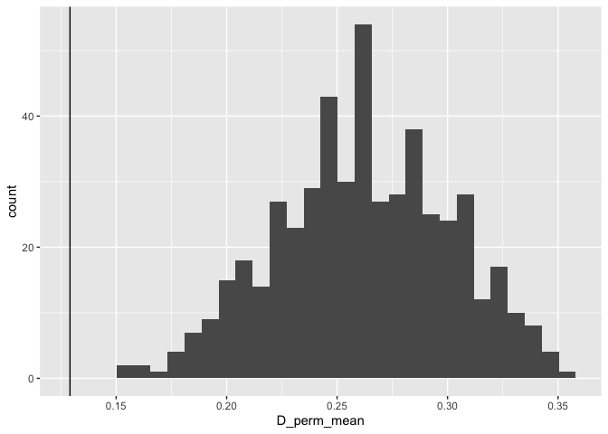
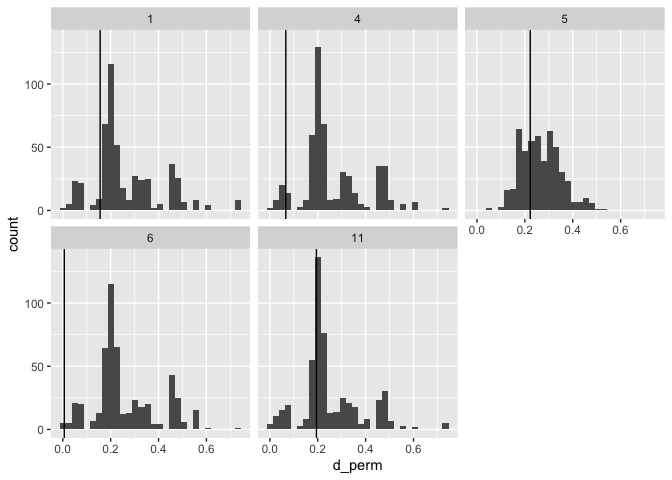

Empirical data analysis for NEE revision
================
Shai Pilosof
April 16, 2020

``` r
db <- dbConnect(SQLite(), dbname = '/Users/Shai/GitHub/CRISPR_networks/CRISPR_database_V2.sqlite')
```

# Analysis

We analyze the modular structure of host-spacer networks and the
weighted-nested structure of immunity networks in three data sets:
Yellowstone, Pseudomonas with virus cluster 3 and Russia 2010.

## Host-spacr networks

In host spacer networks we test for significance by shuffling the
host-spacer network with an equiprobable algorithm. All the networks are
significantly modular.

``` r
plot_grid(Yellowstone$p1, Yellowstone$p2,
          Pseudomonas$p1, Pseudomonas$p2,
          Russia2010$p1, Russia2010$p2,
          ncol=2, nrow=3, align = 'vh', labels = letters[1:6], label_size = 16, scale = 0.95)
```

    ## `stat_bin()` using `bins = 30`. Pick better value with `binwidth`.
    ## `stat_bin()` using `bins = 30`. Pick better value with `binwidth`.
    ## `stat_bin()` using `bins = 30`. Pick better value with `binwidth`.

<!-- -->

## Host-spacr networks

In immunity networks we test for significance by shuffling the values of
interactions (model `r00_samp`). These are all significantly modular.

``` r
plot_grid(Yellowstone$p4, NULL,
          Pseudomonas$p4, Pseudomonas$p3,
          Russia2010$p4, Russia2010$p3,
          ncol=2, nrow=3, align = 'vh', labels = c('a','',letters[2:5]), label_size = 16, scale = 0.95)
```

    ## `stat_bin()` using `bins = 30`. Pick better value with `binwidth`.
    ## `stat_bin()` using `bins = 30`. Pick better value with `binwidth`.
    ## `stat_bin()` using `bins = 30`. Pick better value with `binwidth`.
    ## `stat_bin()` using `bins = 30`. Pick better value with `binwidth`.
    ## `stat_bin()` using `bins = 30`. Pick better value with `binwidth`.

<!-- -->

# Phylogenetic analysis

We look for phylogenetic signal in the host-spacer network of the Russia
2010 data set. The
tree:

``` r
plot(tree)
```

<!-- -->

But not all the strains appear in the tree and in the network.

``` r
# Difference between tree and matrix
nodes_in_modules <- host_sp_modularity$modules %>%
  filter(str_starts(node_name, 'M')) %>%
  distinct(node_name) %>% 
  mutate(node_name=str_replace_all(node_name, pattern = '\\.', ''))
nodes_in_modules <- nodes_in_modules$node_name
nodes_in_tree <- tree$tip.label
print(setdiff(nodes_in_modules, nodes_in_tree)) # In modules but not in tree
```

    ##  [1] "M0608"  "M0534"  "M05030" "M0414"  "M0315"  "M03050" "M03016" "M02219"
    ##  [9] "M02020" "M0121"  "M0113"  "M0102"

``` r
print(setdiff(nodes_in_tree, nodes_in_modules)) # In tree but not in modules
```

    ## [1] "U328"

``` r
# Overlapping nodes:
(overlapping <- intersect(nodes_in_tree, nodes_in_modules))
```

    ##  [1] "M05025" "M02311" "M04010" "M04037" "M0515"  "M04013" "M03027" "M0325" 
    ##  [9] "M04029" "M0501"  "M0216"  "M0132"  "M02113" "M0624"  "M05043" "M02037"
    ## [17] "M03042"

There are only 17 overlapping strains out of 29 in the network.

## Phylogenetic distance within moduels

First we calculate the mean phylogenetic distance between hosts within
modules, and the mean of these distances. Note that not all modules are
represented. This is because some of the modules have a single strain
(distance requires minimum 2), and because not all the strains in the
original network are included due to low overlap with strains in the
tree.

``` r
# Number of strains in a module
M_obs %>% group_by(m) %>% count()
```

    ## # A tibble: 10 x 2
    ## # Groups:   m [10]
    ##        m     n
    ##    <int> <int>
    ##  1     1     2
    ##  2     2     1
    ##  3     3     1
    ##  4     4     2
    ##  5     5     4
    ##  6     6     2
    ##  7     7     1
    ##  8     8     1
    ##  9    11     2
    ## 10    13     1

``` r
# PD
print(D_obs) # mean PD within modules
```

    ## # A tibble: 5 x 2
    ##       m  d_mean
    ##   <int>   <dbl>
    ## 1     1 0.156  
    ## 2     4 0.0664 
    ## 3     5 0.222  
    ## 4     6 0.00616
    ## 5    11 0.195

``` r
print(D_obs_mean) # mean of means
```

    ## [1] 0.1290994

## Significane of phylogenetic distance

### Across modules using mean of PD means

Now shuffle to create permuted modules of the same size and recalculate
the mean PD within modules. The shuffling permutes the ID of the
strains. The null hypothesis is that the permuted distance is smaller
than the observed for each module (i.e., no signal). If we **reject**
this hypothesis then there is phylogenetic signal because the observed
PD beteween hosts within each module would be smaller than expected by
chance (closely related hosts share a module). We see that if we
consider the mean of mean PD across modules then we indeed reject this
hypothesis, so there is a phylogenetic signal.

``` r
# Plot the means 
D_perm %>% group_by(run) %>% 
  summarise(D_perm_mean=mean(d_mean)) %>% 
  ggplot(aes(x=D_perm_mean))+geom_histogram()+geom_vline(xintercept = D_obs_mean)
```

    ## `stat_bin()` using `bins = 30`. Pick better value with `binwidth`.

<!-- -->

``` r
D_perm %>% group_by(run) %>% 
  summarise(D_perm=mean(d_mean)) %>% 
  mutate(test=D_perm<D_obs_mean) %>%
  summarise(pvalue=sum(test)/nperm) %>% 
  mutate(res=ifelse(pvalue<0.05,'Signal','No signal'))
```

    ## # A tibble: 1 x 2
    ##   pvalue res   
    ##    <dbl> <chr> 
    ## 1      0 Signal

### Within modules using mean PD

But we can also test this per module. Here we obtain a distribution per
module and estimate significane per module with or without Bonferroni
correction (reducing the threshold for significance by dividing 0.05 by
5 modules).

``` r
# This can also be tested per module
observations <- nperm*nrow(D_obs)
D_perm %>% 
  full_join(D_obs, by='m') %>% 
  rename(d_perm=d_mean.x, d_obs=d_mean.y) %>% 
  ggplot(aes(x=d_perm))+
  geom_histogram()+
  facet_wrap(~m)+
  geom_vline(data = D_obs, aes(xintercept = d_mean))
```

    ## `stat_bin()` using `bins = 30`. Pick better value with `binwidth`.

<!-- -->

``` r
D_perm %>% 
  full_join(D_obs, by='m') %>% 
  rename(d_perm=d_mean.x, d_obs=d_mean.y) %>% 
  mutate(test=d_perm<d_obs) %>%  
  group_by(m) %>% 
  summarise(pvalue=sum(test)/nperm) %>% 
  mutate(Signif=ifelse(pvalue<0.05,'Signal','No signal'),
         Signif_Bonferroni=ifelse(pvalue<0.05/5,'Signal','No signal')) # Need to divide by 5 (number of modules) for Bonferroni correction
```

    ## # A tibble: 5 x 4
    ##       m pvalue Signif    Signif_Bonferroni
    ##   <int>  <dbl> <chr>     <chr>            
    ## 1     1  0.116 No signal No signal        
    ## 2     4  0.076 No signal No signal        
    ## 3     5  0.33  No signal No signal        
    ## 4     6  0     Signal    Signal           
    ## 5    11  0.268 No signal No signal

``` r
dbDisconnect(db)
```
